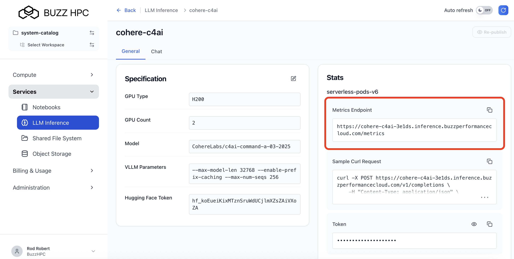

# BUZZ Dedicated LLM Endpoint Inference Dashboard

**[🚀 Open the Dashboard](https://buzzhpc.github.io/llm-dashboard/)**

A real-time browser-based dashboard for monitoring your BUZZ dedicated LLM inference endpoints. No installation required — runs entirely in your browser.

---

## Finding Your Metrics Endpoint

Your metrics URL is available in the **BUZZ LLM Inference Console** on the details page for your dedicated endpoint.

1. Log in to [cloud.buzzhpc.ai](https://cloud.buzzhpc.ai)
2. Navigate to **LLM Inference** → select your dedicated endpoint
3. On the endpoint detail page, copy the **Metrics URL** (ends in `/metrics`)
4. Open the [dashboard](https://buzzhpc.github.io/llm-dashboard/), click **＋ Add Metrics Endpoint**, paste the URL, and click **Add Endpoint**

---

## What You Can Monitor

| Metric | Description |
|--------|-------------|
| **Requests Running** | Active requests currently being processed by the engine |
| **Requests Waiting** | Requests queued waiting for capacity |
| **KV Cache Usage** | GPU memory cache utilisation % |
| **Prefix Cache Hit Rate** | % of tokens served from cache (efficiency signal) |
| **Avg TTFT** | Average time to first token |
| **Avg E2E Latency** | Average end-to-end request latency |
| **Prompt / Gen Tokens/sec** | Real-time throughput |
| **Request Outcomes** | Breakdown of completed, aborted, and error requests |
| **Latency Distributions** | TTFT and E2E latency histograms |

---

## Features

- **Multi-endpoint support** — add as many inference endpoints as you like, switch between them with a click
- **Compare mode** — overlay metrics from multiple endpoints on the same chart to compare performance side by side
- **Persistent across reloads** — your endpoint list is saved in browser localStorage
- **No backend required** — the dashboard polls your endpoint's `/metrics` URL directly from your browser
- **Live polling** — updates every 5 seconds

---

## Notes

- The `/metrics` endpoint serves live Prometheus-format metrics — the dashboard computes rates (tokens/sec, req/sec) by comparing consecutive polls
- Your browser must be able to reach the metrics URL directly (CORS must be enabled on the endpoint, which BUZZ dedicated endpoints support)
- The dashboard keeps a rolling in-memory history of the last ~600 data points (~50 minutes at 5s intervals)
